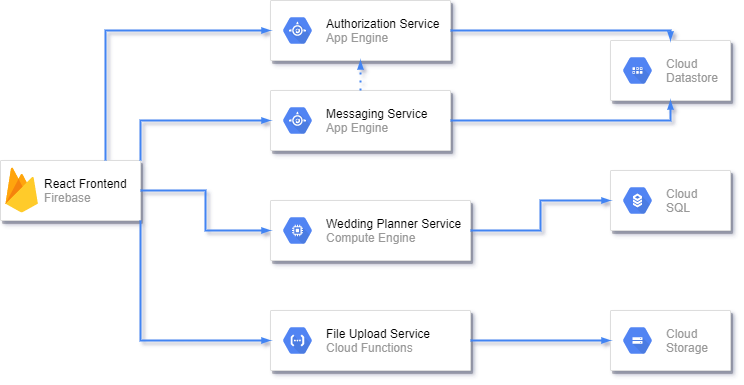

# Project 1
### Due Monday 9/20

# Wedding Planner
You will be making a wedding planner application for a small company. (You can come up with the name and theming of the company). You will present it **Monday 9/20**. 

## Functional Requirements
- Employees should be able to create/edit/delete weddings. 
    - Weddings should have the following information
        - date
        - location
        - name
        - budget
- Employees should be able to create/edit/delete Expenses for a wedding
    - Expenses should have the following information
        - reason
        - amount
    - Expenses can be created with a photo attached for reimbursement purposes
- Employees should be able to message each other.

## Technical Requirements
The applcation you are developing will be fully deployed on GCP. The whole application should be one GCP project. You are building a micro-services application. There are **4 backend-services** you will be creating. The front-end will be written in React. All code must be in GitLab. You should have 5 total repositories. 

### Front-end
- Written using React
    - You may use JS or TS
    - Should have at least 3 pages
        - Login Page
        - Chat Page
        - Planner Page
- The front-end should be hosted on **Firebase** hosting

### Wedding Planner Service
- RESTful web service for keeping track of weddings and expenses
- Written in TS
    - Should follow proper layers with API, Service and data layer
- jest tests for DAO
- postman requests for endpoints
- Routes
    - GET /weddings
    - GET /weddings/:id
    - GET /weddings/:id/expenses
    - POST /weddings
    - DELETE /weddings/:id
    - PUT /weddings
    - GET /expenses
    - GET /expenses/:id
    - POST /expenses
    - PUT /expenses/:id
    - DELETE /expenses/:id
- Routes should have back appropiate JSONs and status codes
- Data should be saved to a Postgres SQL Database hosted on **Cloud SQL**
- The service should be hosted on **Compute Engine**
- Have a Terraform script for creating this service *Do Last*

### Authorization Service
- Web Service responsible for logging in employees and getting information
- This is not a RESTful web service and does not have architecture-adherance requirements
- Routes
    - PATCH /users/login 
        - Request Body: {"email": "bill@wed.com", "password":"gatorfan1"}
        - Response Body: {"fname":"Bill", "lname":"Smith"}
    - GET /users/:email/verify
        - 200 if user exists
        - 404 if no user found
- This service should be hosted on **App Engine**
- Data should be saved in NoSQL **Datastore**
    - You should manually put some employees in the database

### Message Service
- Service for employees to message each other
- does not have architecture-adherance requirements
- Routes
    - GET /messages
    - GET /messages/:mid
    - GET /messages?recipient=someone
    - GET /messages?sender=someone
    - GET /messages?sender=someone&recipient=someoneelse
        - Should return messages where both conditions are met
    - POST /messages
        - Request Body {"sender": "bill@wed.com", "recipient": "jane@wed.com", "note":"great job"}
- The service should add a timestamp property to the message when you create a message
- The service should make a request to the Authorization Service to verify both emails are valid before saving the information.
- Data should be saved to a NoSQL **Datastore** database
- This service should be hosted on **App Engine**

### File Upload Service
- Service for uploading a photo and keeping a public link
- does not have architecture-adherance requirements
- Routes
    - POST /uploadphoto
        - Response Body {"photolink":"googleapis.com/mybucket/sfef234fsfs3234"}
- Should verify that the file is a png or jpg
- Should verify file is less than 10mb in size
- Returns a JSON that contains a link to the photo
- Photos should be stored on a **Cloud Storage Bucket**
- Service is hosted via **Cloud Function**

## Tips
- Tackle each service individually. The services are largely self contained.
- Try to work in vertical slices
    - Build one backend service and front-end page at a time
- Use each other and me for help!
- You do not have all technologies needed to complete this yet
- tackle them in order of doability
    1. RESTful planner service and Planner Page
    2. Authorization Service, Message Service, Chat Page and login page
    3. File Upload Service 
    

## Bonus
- If you finish the main requirements here are some additional features
    - Implement JWTS in the authorization service to create security
    - The other services are inaccessible without a JWT
    - Have your Wedding Planner service hosted behind a load balancer

DB Password: 0vEu0qOL1t0cBuPy
